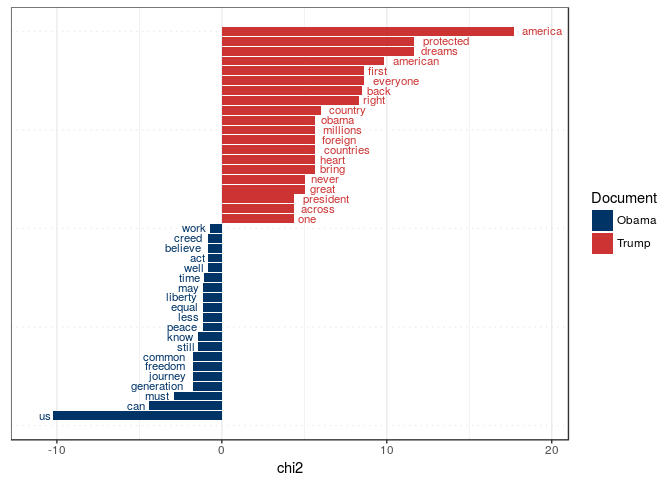

Text Analysis in R: online appendix
================
Kasper Welbers, Wouter van Atteveldt & Kenneth Benoit
2017

About this document
-------------------

This is the online appendix for xxx, that contains the example code presented in the article. The code in this appendix will be kept up-to-date with changes in the used packages, and as such can differ slightly from the code presented in the article.

In addition, this appendix contains references to other tutorials, that provide additional instructions for alternative, more in-dept or newly developed text anaysis operations.

### required packages

The following packages have to be installed to run all the code examples. Note that the lines to install the packages only have to be run once.

``` r
################# PACKAGE       # SECTION IN ARTICLE
install.packages("readtext")    # data preparation
install.packages("stringi")     # data preparation
install.packages("quanteda")    # data preparation and analysis
install.packages("topicmodels") # analysis
install.packages("spacyr")      # advanced topics
install.packages("corpustools") # advanced topics
```

Data Preparation
----------------

### String Operations

``` r
library(readtext)  

# url to Inaugural Address demo data that is provided by the readtext package 
filepath <- "http://bit.ly/2uhqjJE?.csv"

rt <- readtext(filepath, text_field = "texts") 
rt
## readtext object consisting of 5 documents and 3 docvars.
## # data.frame [5 x 5]
##           doc_id                text  Year  President FirstName
##            <chr>               <chr> <int>      <chr>     <chr>
## 1 2uhqjJE?.csv.1 "\"Fellow-Cit\"..."  1789 Washington    George
## 2 2uhqjJE?.csv.2 "\"Fellow cit\"..."  1793 Washington    George
## 3 2uhqjJE?.csv.3 "\"When it wa\"..."  1797      Adams      John
## 4 2uhqjJE?.csv.4 "\"Friends an\"..."  1801  Jefferson    Thomas
## 5 2uhqjJE?.csv.5 "\"Proceeding\"..."  1805  Jefferson    Thomas
```

### String Operations

``` r
library(stringi) 
x <- c("The first string", ' The <font size="6">second string</font>') 

x <- stri_replace_all(x, "", regex = "<.*?>")   # remove html tags 
x <- stri_trim(x)                               # strip surrounding whitespace
x <- stri_trans_tolower(x)                      # transform to lower case 
x
## [1] "the first string"  "the second string"
```

### Preprocessing

#### Tokenization

``` r
library(quanteda) 
## quanteda version 0.99.10
## Using 7 of 8 threads for parallel computing
## 
## Attaching package: 'quanteda'
## The following object is masked from 'package:utils':
## 
##     View

text <- "An example of preprocessing techniques" 
toks <- tokens(text)  # tokenize into unigrams 
toks
## tokens from 1 document.
## text1 :
## [1] "An"            "example"       "of"            "preprocessing"
## [5] "techniques"
```

#### Normalization: lowercasing and stemming

``` r
toks <- tokens_tolower(toks) 
toks <- tokens_wordstem(toks) 
toks
## tokens from 1 document.
## text1 :
## [1] "an"         "exampl"     "of"         "preprocess" "techniqu"
```

#### Removing stopwords

``` r
sw <- stopwords("english")   # get character vector of stopwords 
head(sw)                     # show head (first 6) stopwords
## [1] "i"      "me"     "my"     "myself" "we"     "our"
tokens_remove(toks, sw)
## tokens from 1 document.
## text1 :
## [1] "exampl"     "preprocess" "techniqu"
```

### Document-Term Matrix

``` r
text <-  c(d1 = "An example of preprocessing techniques",  
           d2 = "An additional example",  
           d3 = "A third example") 
dtm <- dfm(text,                           # input text
           tolower = TRUE, stem = TRUE,    # set lowercasing and stemming to TRUE
           remove = stopwords("english"))  # provide the stopwords for deletion
dtm
## Document-feature matrix of: 3 documents, 5 features (53.3% sparse).
## 3 x 5 sparse Matrix of class "dfmSparse"
##     features
## docs exampl preprocess techniqu addit third
##   d1      1          1        1     0     0
##   d2      1          0        0     1     0
##   d3      1          0        0     0     1

fulltext <- corpus(rt)                              # create quanteda corpus 
dtm <- dfm(fulltext, tolower = TRUE, stem = TRUE,   # create dtm with preprocessing
           remove_punct = TRUE,remove = stopwords("english")) 
dtm
## Document-feature matrix of: 5 documents, 1,405 features (67.9% sparse).
```

### Filtering and weighting

``` r
doc_freq <- docfreq(dtm)         # document frequency per term (column) 
dtm <- dtm[, doc_freq >= 2]      # select terms with doc_freq >= 2 
dtm <- dfm_weight(dtm, "tfidf")  # weight the features using tf-idf 
head(dtm)
## Document-feature matrix of: 5 documents, 6 features (40% sparse).
## 5 x 6 sparse Matrix of class "dfmSparse"
##                 features
## docs             fellow-citizen   senat    hous    repres      among
##   2uhqjJE?.csv.1      0.2218487 0.39794 0.79588 0.4436975 0.09691001
##   2uhqjJE?.csv.2      0         0       0       0         0         
##   2uhqjJE?.csv.3      0.6655462 0.39794 1.19382 0.6655462 0.38764005
##   2uhqjJE?.csv.4      0.4436975 0       0       0.2218487 0.09691001
##   2uhqjJE?.csv.5      0         0       0       0         0.67837009
##                 features
## docs                   life
##   2uhqjJE?.csv.1 0.09691001
##   2uhqjJE?.csv.2 0         
##   2uhqjJE?.csv.3 0.19382003
##   2uhqjJE?.csv.4 0.09691001
##   2uhqjJE?.csv.5 0.19382003
```

Analysis
--------

Prepare DTM for analysis examples.

``` r
dtm <- dfm(data_corpus_inaugural, stem = TRUE, remove = stopwords("english"),  
           remove_punct = TRUE) 
dtm
## Document-feature matrix of: 58 documents, 5,405 features (89.2% sparse).
```

### Counting and Dictionary

``` r
myDict <- dictionary(list(terror = c("terror*"), 
                          economy = c("job*", "business*", "econom*"))) 
dict_dtm <- dfm_lookup(dtm, myDict, nomatch = "_unmatched") 
tail(dict_dtm)
## Document-feature matrix of: 6 documents, 3 features (16.7% sparse).
## 6 x 3 sparse Matrix of class "dfmSparse"
##               features
## docs           terror economy _unmatched
##   1997-Clinton      2       3       1125
##   2001-Bush         0       2        782
##   2005-Bush         0       1       1040
##   2009-Obama        1       7       1165
##   2013-Obama        0       6       1030
##   2017-Trump        1       5        709
```

### Supervised Machine Learning

``` r
set.seed(2) 
# create a document variable indicating pre or post war 
docvars(dtm, "is_prewar") <- docvars(dtm, "Year") < 1945 

# sample 40 documents for the training set and use remaining (18) for testing 
train_dtm <- dfm_sample(dtm, size = 40)
test_dfm <- dtm[setdiff(docnames(dtm), docnames(train_dtm)), ] 

# fit a Naive Bayes multinomial model and use it to predict the test data 
nb_model <- textmodel_NB(train_dtm, y = docvars(train_dtm, "is_prewar")) 
pred_nb <- predict(nb_model, newdata = test_dfm)

# compare prediction (rows) and actual is_prewar value (columns) in a table 
table(prediction = pred_nb$nb.predicted, is_prewar = docvars(test_dfm, "is_prewar"))
##           is_prewar
## prediction FALSE TRUE
##      FALSE     8    0
##      TRUE      0   10
```

### Unsupervised Machine Learning

``` r
library(topicmodels) 

texts = corpus_reshape(data_corpus_inaugural, to = "paragraphs")

par_dtm <- dfm(texts, stem = TRUE,              # create a document-term matrix
               remove_punct = TRUE, remove = stopwords("english"))
par_dtm <- dfm_trim(par_dtm, min_count = 5)     # remove rare terms
par_dtm <- convert(par_dtm, to = "topicmodels") # convert to topicmodels format

set.seed(1)
lda_model <- topicmodels::LDA(par_dtm, method = "Gibbs", k = 5) 
terms(lda_model, 5)
##      Topic 1     Topic 2  Topic 3   Topic 4    Topic 5  
## [1,] "govern"    "nation" "great"   "us"       "shall"  
## [2,] "state"     "can"    "war"     "world"    "citizen"
## [3,] "power"     "must"   "secur"   "new"      "peopl"  
## [4,] "constitut" "peopl"  "countri" "american" "duti"   
## [5,] "law"       "everi"  "unit"    "america"  "countri"
```

### Statistics

``` r
# create DTM that contains Trump and Obama speeches
corpus_pres = corpus_subset(data_corpus_inaugural, 
                            President %in% c("Obama", "Trump"))
dtm_pres = dfm(corpus_pres, groups = "President", 
               remove = stopwords("english"), remove_punct = TRUE)

# compare target (in this case Trump) to rest of DTM (in this case only Obama).
keyness = textstat_keyness(dtm_pres, target = "Trump") 
textplot_keyness(keyness)
```



Advanced Topics
---------------

### Advanced NLP

``` r
library(spacyr) 

spacy_initialize(python_executable = "/usr/local/bin/python") 
## successfully initialized (spaCy Version: 1.9.0, language model: en)
d <- spacy_parse("Bob Smith gave Alice his login information.", dependency = TRUE) 
d[, -c(1,2)]
##   token_id       token       lemma   pos head_token_id  dep_rel   entity
## 1        1         Bob         bob PROPN             2 compound PERSON_B
## 2        2       Smith       smith PROPN             3    nsubj PERSON_I
## 3        3        gave        give  VERB             3     ROOT         
## 4        4       Alice       alice PROPN             3   dative PERSON_B
## 5        5         his      -PRON-   ADJ             7     poss         
## 6        6       login       login  NOUN             7 compound         
## 7        7 information information  NOUN             3     dobj         
## 8        8           .           . PUNCT             3    punct
```

### Word Positions and Syntax

``` r
text <- "an example of preprocessing techniques" 
tokens(text, ngrams = 3, skip = 0:1)
## tokens from 1 document.
## text1 :
## [1] "an_example_of"                    "an_example_preprocessing"        
## [3] "an_of_preprocessing"              "an_of_techniques"                
## [5] "example_of_preprocessing"         "example_of_techniques"           
## [7] "example_preprocessing_techniques" "of_preprocessing_techniques"
```

``` r
library(corpustools)
## Loading required package: Matrix
## Loading required package: data.table
 
tc <- create_tcorpus(sotu_texts, doc_column = "id") 
hits <- tc$search_features('"freedom americ*"~5')
## Created feature index
kwic <- tc$kwic(hits, ntokens = 3) 
head(kwic$kwic, 3)
## [1] "...making progress toward <freedom> will find <America> is their friend..."    
## [2] "...friends, and <freedom> in Iraq will make <America> safer for generations..."
## [3] "...men who despise <freedom>, despise <America>, and aim..."
```
