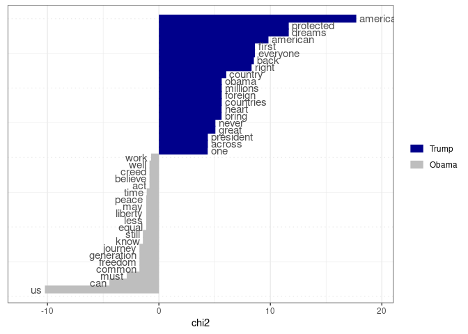

Text Analysis in R: online appendix
================
Kasper Welbers, Wouter van Atteveldt & Kenneth Benoit
2023

## About this document

This is the online appendix for [Welbers, van Atteveldt & Benoit
(2017)](http://www.tandfonline.com/doi/full/10.1080/19312458.2017.1387238),
that contains the example code presented in the article. The code in
this appendix will be kept up-to-date with changes in the used packages,
and as such can differ slightly from the code presented in the article.

<!-- In addition, this appendix contains references to other tutorials, that provide additional instructions for alternative, more in-dept or newly developed text anaylysis operations. -->

### required packages

The following packages have to be installed to run all the code
examples. Note that the lines to install the packages only have to be
run once.

``` r
################# PACKAGE       # SECTION IN ARTICLE
install.packages("readtext")    # data preparation
install.packages("stringi")     # data preparation

install.packages("quanteda")    # data preparation and analysis
install.packages('quanteda.textmodels') 
install.packages('quanteda.textstats')
install.packages('quanteda.textplots')

install.packages("topicmodels") # analysis

install.packages("spacyr")      # advanced topics
install.packages("corpustools") # advanced topics
```

## Data Preparation

### String Operations

``` r
library(readtext)  
# url to Inaugural Address demo data that is provided by the readtext package 
filepath <- "https://raw.githubusercontent.com/kbenoit/readtext/master/inst/extdata/csv/inaugCorpus.csv"

rt <- readtext(filepath, text_field = "texts") 
rt
## readtext object consisting of 5 documents and 3 docvars.
## $text
## [1] "# A data frame: 5 × 5"                                                   
## [2] "  doc_id            text                 Year President  FirstName"      
## [3] "  <chr>             <chr>               <int> <chr>      <chr>    "      
## [4] "1 inaugCorpus.csv.1 \"\\\"Fellow-Cit\\\"...\"  1789 Washington George   "
## [5] "2 inaugCorpus.csv.2 \"\\\"Fellow cit\\\"...\"  1793 Washington George   "
## [6] "3 inaugCorpus.csv.3 \"\\\"When it wa\\\"...\"  1797 Adams      John     "
## [7] "4 inaugCorpus.csv.4 \"\\\"Friends an\\\"...\"  1801 Jefferson  Thomas   "
## [8] "5 inaugCorpus.csv.5 \"\\\"Proceeding\\\"...\"  1805 Jefferson  Thomas   "
## 
## $summary
## $summary[[1]]
## NULL
## 
## 
## attr(,"class")
## [1] "trunc_mat"
```

### String Operations

``` r
library(stringi) 
x <- c("The first string", ' The <font size="6">second string</font>') 

x <- stri_replace_all(x, "", regex = "<.*?>")   # remove html tags 
x <- stri_trim(x)                               # strip surrounding whitespace
x <- stri_trans_tolower(x)                      # transform to lower case 
x
## [1] "the first string"  "the second string"
```

### Preprocessing

#### Tokenization

``` r
library(quanteda) 
## Package version: 3.3.0
## Unicode version: 14.0
## ICU version: 70.1
## Parallel computing: 8 of 8 threads used.
## See https://quanteda.io for tutorials and examples.
## 
## Attaching package: 'quanteda'
## The following objects are masked from 'package:readtext':
## 
##     docnames, docvars, texts

text <- "An example of preprocessing techniques" 
toks <- tokens(text)  # tokenize into unigrams 
toks
## Tokens consisting of 1 document.
## text1 :
## [1] "An"            "example"       "of"            "preprocessing"
## [5] "techniques"
```

#### Normalization: lowercasing and stemming

``` r
toks <- tokens_tolower(toks) 
toks <- tokens_wordstem(toks) 
toks
## Tokens consisting of 1 document.
## text1 :
## [1] "an"         "exampl"     "of"         "preprocess" "techniqu"
```

#### Removing stopwords

``` r
sw <- stopwords("english")   # get character vector of stopwords 
head(sw)                     # show head (first 6) stopwords
## [1] "i"      "me"     "my"     "myself" "we"     "our"
tokens_remove(toks, sw)
## Tokens consisting of 1 document.
## text1 :
## [1] "exampl"     "preprocess" "techniqu"
```

### Document-Term Matrix

Since the publication of the Text Analysis in R paper, the quanteda
package has gone through several updates. One important change is that
many operations are now cut down into separate steps. This works nicely
together with the now common pipe notation (`|>`, or `%>%` in
tidyverse).

Before, we created a dfm with one single do-it-all function. Now, we run
our data through a pipeline of functions that each perform a single
step.

``` r
text <-  c(d1 = "An example of preprocessing techniques",  
           d2 = "An additional example",  
           d3 = "A third example") 

dtm <- text |>
  corpus() |>                          ## create quanteda corpus
  tokens() |>                          ## tokenize the corpus
  dfm() |>                             ## structure tokens as Document Term Matrix
  dfm_tolower() |>                     ## preprocessing: lowercase
  dfm_wordstem() |>                    ## preprocessing: stemming
  dfm_remove(stopwords('english'))     ## preprocessing: remove English stopwords
  
dtm
## Document-feature matrix of: 3 documents, 5 features (53.33% sparse) and 0 docvars.
##     features
## docs exampl preprocess techniqu addit third
##   d1      1          1        1     0     0
##   d2      1          0        0     1     0
##   d3      1          0        0     0     1
```

Create the DTM using the inaugural speeches (rt) that we read into R
above.

``` r
dtm <- rt |> 
  corpus() |> 
  tokens() |>
  dfm() |>
  dfm_tolower() |>
  dfm_wordstem() |>
  dfm_remove(stopwords('english')) 

dtm
## Document-feature matrix of: 5 documents, 1,422 features (67.45% sparse) and 3 docvars.
##                    features
## docs                fellow-citizen senat hous repres : among vicissitud incid
##   inaugCorpus.csv.1              1     1    2      2 1     1          1     1
##   inaugCorpus.csv.2              0     0    0      0 1     0          0     0
##   inaugCorpus.csv.3              3     1    3      3 0     4          0     0
##   inaugCorpus.csv.4              2     0    0      1 1     1          0     0
##   inaugCorpus.csv.5              0     0    0      0 0     7          0     0
##                    features
## docs                life event
##   inaugCorpus.csv.1    1     2
##   inaugCorpus.csv.2    0     0
##   inaugCorpus.csv.3    2     0
##   inaugCorpus.csv.4    1     0
##   inaugCorpus.csv.5    2     1
## [ reached max_nfeat ... 1,412 more features ]
```

### Filtering and weighting

``` r
doc_freq <- docfreq(dtm)         # document frequency per term (column) 
dtm <- dtm[, doc_freq >= 2]      # select terms with doc_freq >= 2 
dtm <- dfm_tfidf(dtm)            # weight the features using tf-idf 
head(dtm)
## Document-feature matrix of: 5 documents, 530 features (46.34% sparse) and 3 docvars.
##                    features
## docs                fellow-citizen   senat    hous    repres         :
##   inaugCorpus.csv.1      0.2218487 0.39794 0.79588 0.4436975 0.2218487
##   inaugCorpus.csv.2      0         0       0       0         0.2218487
##   inaugCorpus.csv.3      0.6655462 0.39794 1.19382 0.6655462 0        
##   inaugCorpus.csv.4      0.4436975 0       0       0.2218487 0.2218487
##   inaugCorpus.csv.5      0         0       0       0         0        
##                    features
## docs                     among       life   event greater anxieti
##   inaugCorpus.csv.1 0.09691001 0.09691001 0.79588 0.39794 0.39794
##   inaugCorpus.csv.2 0          0          0       0       0      
##   inaugCorpus.csv.3 0.38764005 0.19382003 0       0       0.39794
##   inaugCorpus.csv.4 0.09691001 0.09691001 0       0.39794 0      
##   inaugCorpus.csv.5 0.67837009 0.19382003 0.39794 0       0      
## [ reached max_nfeat ... 520 more features ]
```

## Analysis

Prepare DTM for analysis examples.

``` r
dtm <- data_corpus_inaugural |>
  corpus() |> 
  tokens(remove_punct = T) |> 
  dfm() |>
  dfm_tolower() |> 
  dfm_wordstem() |>
  dfm_remove(stopwords('english'))

dtm
## Document-feature matrix of: 59 documents, 5,468 features (89.25% sparse) and 4 docvars.
##                  features
## docs              fellow-citizen senat hous repres among vicissitud incid life
##   1789-Washington              1     1    2      2     1          1     1    1
##   1793-Washington              0     0    0      0     0          0     0    0
##   1797-Adams                   3     1    3      3     4          0     0    2
##   1801-Jefferson               2     0    0      1     1          0     0    1
##   1805-Jefferson               0     0    0      0     7          0     0    2
##   1809-Madison                 1     0    0      1     0          1     0    1
##                  features
## docs              event fill
##   1789-Washington     2    1
##   1793-Washington     0    0
##   1797-Adams          0    0
##   1801-Jefferson      0    0
##   1805-Jefferson      1    0
##   1809-Madison        0    1
## [ reached max_ndoc ... 53 more documents, reached max_nfeat ... 5,458 more features ]
```

### Counting and Dictionary

``` r
myDict <- dictionary(list(terror = c("terror*"), 
                          economy = c("job*", "business*", "econom*"))) 
dict_dtm <- dfm_lookup(dtm, myDict, nomatch = "_unmatched") 
tail(dict_dtm)
## Document-feature matrix of: 6 documents, 3 features (16.67% sparse) and 4 docvars.
##             features
## docs         terror economy _unmatched
##   2001-Bush       0       2        796
##   2005-Bush       0       1       1056
##   2009-Obama      1       7       1192
##   2013-Obama      0       6       1052
##   2017-Trump      1       5        723
##   2021-Biden      1       4       1146
```

### Supervised Machine Learning

``` r
library(quanteda)
library(quanteda.textmodels)
```

``` r
set.seed(2) 
# create a document variable indicating pre or post war 
docvars(dtm, "is_prewar") <- docvars(dtm, "Year") < 1945 

# sample 40 documents for the training set and use remaining (18) for testing 
train_dtm <- dfm_sample(dtm, size = 40)
test_dtm <- dtm[setdiff(docnames(dtm), docnames(train_dtm)), ] 

# fit a Naive Bayes multinomial model and use it to predict the test data 
nb_model <- textmodel_nb(train_dtm, y = docvars(train_dtm, "is_prewar")) 
pred_nb <- predict(nb_model, newdata = test_dtm)

# compare prediction (rows) and actual is_prewar value (columns) in a table 
table(prediction = pred_nb, is_prewar = docvars(test_dtm, "is_prewar"))
##           is_prewar
## prediction FALSE TRUE
##      FALSE     6    0
##      TRUE      0   13
```

### Unsupervised Machine Learning

``` r
library(topicmodels) 

texts = corpus_reshape(data_corpus_inaugural, to = "paragraphs")

par_dtm <- texts |> corpus() |> tokens(remove_punct = T) |> 
  dfm() |> dfm_tolower() |> dfm_wordstem() |> 
  dfm_remove(stopwords('english')) |> dfm_trim(min_count = 5) |>
  convert(to = 'topicmodels')

set.seed(1)
lda_model <- topicmodels::LDA(par_dtm, method = "Gibbs", k = 5) 
terms(lda_model, 5)
##      Topic 1  Topic 2     Topic 3   Topic 4    Topic 5  
## [1,] "nation" "state"     "great"   "us"       "shall"  
## [2,] "peopl"  "govern"    "govern"  "american" "peopl"  
## [3,] "can"    "power"     "war"     "new"      "duti"   
## [4,] "must"   "constitut" "countri" "america"  "countri"
## [5,] "everi"  "ani"       "secur"   "world"    "citizen"
```

### Statistics

``` r
library(quanteda.textstats)
library(quanteda.textplots)

# create DTM that contains Trump and Obama speeches
dtm_pres <- data_corpus_inaugural |>
  corpus_subset(President %in% c('Obama','Trump')) |>
  tokens(remove_punct = T) |> 
  dfm() |>
  dfm_remove(stopwords('english'))

# compare target (in this case Trump) to rest of DTM (in this case only Obama).
dtm_pres |>
  dfm_group(President) |>
  textstat_keyness(target = "Trump") |>
  textplot_keyness()
```

<!-- -->

## Advanced Topics

### Advanced NLP

``` r
library(spacyr) 
spacy_install()
spacy_initialize()
d <- spacy_parse("Bob Smith gave Alice his login information.", dependency = TRUE) 
d[, -c(1,2)]
```

### Word Positions and Syntax

``` r
text <- "an example of preprocessing techniques" 

text |>
  tokens() |>
  tokens_ngrams(n=3, skip=0:1)
## Tokens consisting of 1 document.
## text1 :
## [1] "an_example_of"                    "an_example_preprocessing"        
## [3] "an_of_preprocessing"              "an_of_techniques"                
## [5] "example_of_preprocessing"         "example_of_techniques"           
## [7] "example_preprocessing_techniques" "of_preprocessing_techniques"
```

``` r
library(corpustools)
 
tc <- create_tcorpus(sotu_texts, doc_column = "id") 
hits <- search_features(tc, '"freedom americ*"~5')
kwic <- get_kwic(tc, hits, ntokens = 3) 
head(kwic$kwic, 3)
## [1] "...making progress toward <freedom> will find <America> is their friend..."    
## [2] "...friends, and <freedom> in Iraq will make <America> safer for generations..."
## [3] "...men who despise <freedom>, despise <America>, and aim..."
```
